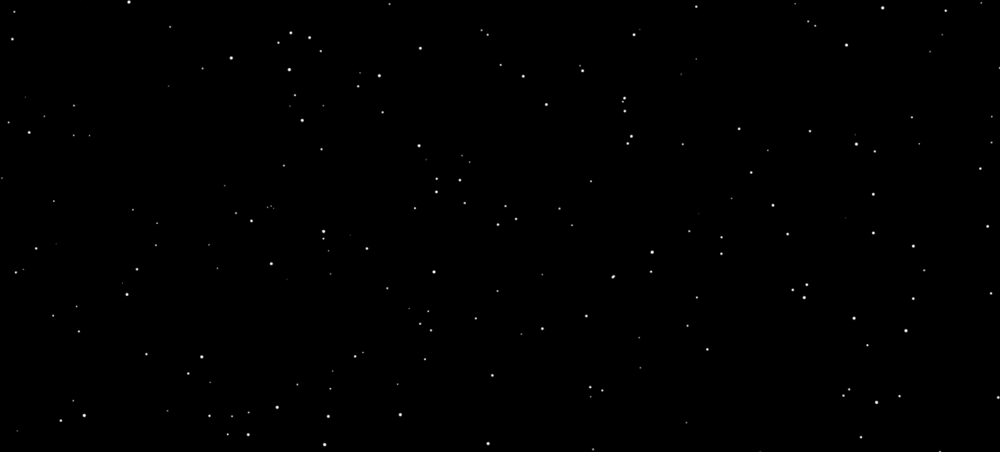

#  Background Animation

A lightweight animated starfield background built using HTML5 Canvas and vanilla JavaScript. 
Stars move smoothly downward to simulate a space-like motion effect, creating an immersive visual background.

##  Features

- Smooth falling star animation  
- Responsive full-screen canvas  
- Lightweight and dependency-free  
- Continuous star recycling effect  
- Centered overlay text support  

##  Tech Stack

- HTML5  
- CSS3  
- JavaScript (Canvas API)

##  How to Run

1. Clone the repository  
2. Open `index.html` in your browser  

No build step required.

##  Use Cases

- Portfolio hero sections  
- Landing page backgrounds  
- Space-themed websites  
- Creative UI experiments  
